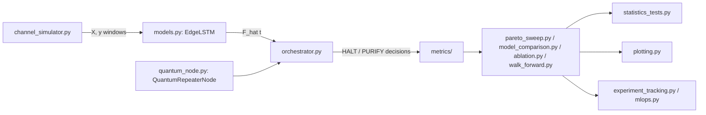

# Architecture

## Package layout

```
quantum-twin/
    pyproject.toml           # build system, dependencies, mypy/ruff/pytest config
    src/quantum_twin/        # the library (import quantum_twin.*)
    experiments/              # standalone scripts that CONSUME the library
    tests/                     # pytest suite, mirrors src/quantum_twin/
    docs/                       # this documentation site (MkDocs Material)
    .github/workflows/ci.yml     # lint -> typecheck -> test -> build -> docs
```

`experiments/` is deliberately kept OUTSIDE `src/quantum_twin/`: it holds
one-off orchestration scripts (parse CLI args, wire configs together, call
into the library, record results) rather than reusable, importable code.
This separation means the library can be imported and tested in complete
isolation from any specific experiment's script, and a new experiment
never requires touching `src/`.

## Module map

The pipeline is a straight line from synthetic data to a decision, with
an evaluation layer wrapped around every stage:



| Module | Responsibility |
|---|---|
| `channel_simulator.py` | Generates the synthetic WDM channel (Ornstein-Uhlenbeck process) and windows it into train/test tensors. |
| `models.py` | `EdgeLSTM` (compact, edge-deployable), `StandardLSTM` (larger, non-edge-optimized counterpart for the ablation study), `CS_MSELoss`. |
| `timing.py` | `InferenceTimer`: CUDA-Event-based (hardware-accurate) latency measurement. |
| `quantum_node.py` | `QuantumRepeaterNode`: the BBPSSW purification circuit under a NISQ noise model (Qiskit Aer), with a latency-driven memory-aging channel. |
| `orchestrator.py` | `DigitalTwinOrchestrator`: the admission-control loop (`run_intelligent` vs. `run_blind_baseline`), producing the confusion matrix. |
| `pareto_sweep.py` | Multi-seed sweep of `CS_MSELoss`'s `lambda_penalty` (the Pareto Frontier). |
| `baselines.py` | Alternative predictors: `LSTM+MSE`, Random Forest, XGBoost, a small Transformer, and the naive/oracle reference baselines. |
| `metrics/` | Split by responsibility: `prediction.py` (regression + temporal timing), `quantum.py` (QPU economy, fidelity stats), `performance.py` (throughput, C_latencia, energy), `decision.py` (confusion-matrix rates, decision matrix). |
| `model_comparison.py` | Cross-architecture comparison + ranked decision matrix. |
| `ablation.py` | 2x2 factorial ablation ({EdgeLSTM, StandardLSTM} x {MSE, CS-MSE}). |
| `sensitivity.py` | +/-10% decision-weight sensitivity analysis. |
| `statistics_tests.py` | Paired t-test / Wilcoxon / Holm-Bonferroni / confidence intervals. |
| `walk_forward.py` | Rolling-origin temporal cross-validation. |
| `reproducibility.py` | `seed_everything` / `set_full_determinism`. |
| `plotting.py` | One chart generator per result table. |
| `latex_export.py` | DataFrame -> `.tex` table export. |
| `experiment_tracking.py` | `ExperimentRun`: local CSV/PNG/TeX/JSON artifact tracking (always available, zero external dependencies). |
| `mlops.py` | `MLflowTracker`: optional MLflow-backed tracking, degrading gracefully when `mlflow` isn't installed. |
| `config.py` | Every configuration dataclass used above. |
| `cli.py` | `main()` + argument parsing; the single entry point that wires everything together. |

## Design principles

- **Every experiment function is a pure function of its config
  dataclasses.** No hidden global state; the exact configuration that
  produced a result is always reconstructible from the dataclass values
  passed in (which is also what makes `experiment_tracking.ExperimentRun.save_config`
  meaningful).
- **Naive/oracle baselines are structurally distinct from trainable
  models**, but share the same `.eval()`/`__call__` runtime contract
  (`metrics.prediction.PredictorLike`), so every downstream function
  (`evaluate_predictor_regression`, `DigitalTwinOrchestrator`) accepts
  either without special-casing.
- **Determinism is explicit, not implicit.** `reproducibility.seed_everything`
  is called once per training round; `reproducibility.set_full_determinism`
  is called once per process, at the top of `cli.main`.
- **Every optional dependency degrades gracefully.** `xgboost` absent ->
  that one baseline is skipped with a warning; `mlflow` absent ->
  `MLflowTracker` no-ops with a single warning; neither ever raises or
  breaks the rest of the pipeline.
